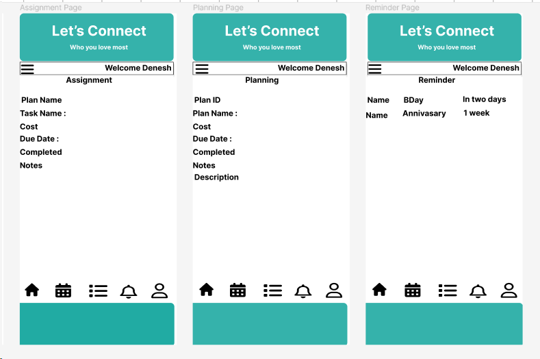

# my_let_s_connect_project_unit_2
Let's Connect, this is my Unit 2 project of GA

#Let's Connect App - People who you love most
 Heartfelt app designed to strengthen bonds and create lasting connections among family and friends. With intuitive features, it facilitates seamless communication, collaborative planning, and the sharing of cherished moments, fostering a sense of togetherness for the ones you hold dear. Experience the joy of staying connected with those who matter most in a personalized and emotionally resonant digital space.

#Key Functionality

--#Personalized Profiles:

Create personalized user profiles with individual preferences, allowing each member to tailor their experience and showcase their unique personality within the app.

    Users Stories :

    As a user, I want to create a personalized profile with my name, profile picture, and a brief bio, so that my family and friends can easily identify me within the app.

    As a user, I want to view and edit my personal information at any time, ensuring that my profile is always up-to-date and reflective of my current status and interests.

--#Task and Chore Management:

Streamline household responsibilities with a built-in task management system, allowing users to assign and track chores for a more organized and efficient family life.

    User Stories :

    As a user, I want to create a new task, assign it to a family member, set a due date, and add a brief description, so that household responsibilities are clearly communicated and organized.

    As a user, I want to mark a task as complete and leave comments or notes for other family members, providing a transparent and collaborative task management system.

--#Event Reminders:

Never miss a special occasion or important event with customizable reminders and notifications for birthdays, anniversaries, and other significant dates.

    User Stories :
    As a user, I want to set a reminder for a specific event or task, receiving timely notifications to ensure I do not forget important dates or commitments.

--#Group Planning and Decision-Making:

Facilitate group discussions and decision-making with built-in features for polls, surveys, and collaborative planning tools to make collective choices seamlessly.

    As a user, I want to create an event on the shared calendar, invite family members, and add important details such as location and time, ensuring seamless coordination for family gatherings and activities.

    As a user, I want to view the shared calendar to see upcoming events, birthdays, and anniversaries, helping me stay informed about important dates within my family.

#Implementing Third-Party APIs - Weather API and Holiday API
    
The goal is to integrate Weather and Holiday APIs to enhance the Let's Connect application. When scheduling events, having access to weather information for a specific date and knowledge of any upcoming holidays is valuable. This allows for more informed planning.

    As a user, I would like to retrieve real-time weather conditions and information about special holidays on a specific date when planning an event. This feature will help me make adjustments to my plans based on the weather and be aware of any significant holidays.

#ERD

#Wireframe

#MVC

 | 

#Technologies

#References

#Screenshots